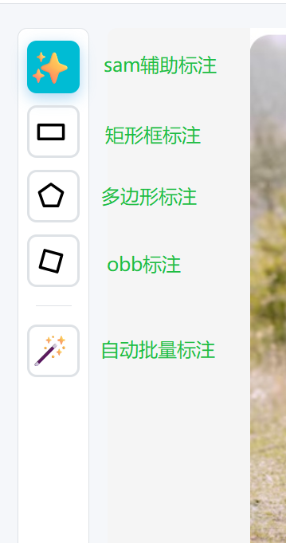

## 四种标注模式

### 模式切换

在标注界面左侧工具栏中，可以点击相应按钮切换四种标注模式：

- ✨ **SAM模式**（快捷键：M）
- ◻️ **矩形框模式**（快捷键：B）
- 🔶 **多边形模式**（快捷键：P）
- 🔷 **OBB旋转框模式**（快捷键：O）

> 💡 **提示：** 当标注目标有重叠时，可以在右侧标注列表中点击眼睛图标显示/隐藏标注对象，方便对被遮挡的目标进行操作。

---

### 1. SAM辅助标注模式 
**使用方法：**

- 左键点击：添加正点（想要包含的区域）
- 右键点击：添加负点（想要排除的区域）
- **点击已有点：删除该点**

**适用场景：** 复杂形状物体的精确分割

**编辑已有标注：** 点击画布上的SAM标注对象可选定，选定后自动切换为多边形模式进行编辑，支持顶点拖拽、右键删除顶点、点击边插入新顶点。

---

### 2. 手动标框模式 
**使用方法：**
1. 切换到矩形框模式
2. 在图像上按住鼠标左键拖拽
4. 如果矩形框太小（宽或高<10像素），系统会自动取消

**编辑已有标注：** 点击画布上的矩形标注可选定，选定后可拖拽四个角点或边调整大小，也可拖拽矩形内部进行整体平移。

---

### 3. 手动多边形模式 
**使用方法：**

1. 切换到多边形模式
2. 左键点击添加多边形顶点
3. 完成标注有2种方式：
   - **点击第一个点**（至少需要3个顶点，推荐）
   - 双击鼠标左键
4. **右键点击已有顶点**可删除该顶点
5. 按 `ESC` 键取消当前绘制

**适用场景：**
- sam标注不准确的时候，需要手动标

**编辑已有标注：** 点击画布上的多边形标注可选定，选定后可拖拽顶点调整位置、右键点击顶点删除、点击边上插入新顶点。

---

### 4. OBB旋转框模式
**使用方法（三点法）：**

1. 切换到OBB模式
2. **第一步：点击A点** - 确定旋转框的第一个角点
3. **第二步：点击B点** - 确定旋转框的一条边（A→B）
4. **第三步：移动鼠标预览** - 系统会实时显示旋转矩形框的预览
5. **第四步：点击C点** - 确定旋转框的宽度，完成标注
6. 按 `ESC` 键取消当前绘制，点击已有点可以删除点

**适用场景：**
- 标注倾斜或旋转的物体（如航拍图像中的车辆、建筑物）
- 需要精确表示物体方向的场景

**导出格式：**
- 标注数据保存在 `labels_obb/` 目录
- 使用YOLO-OBB格式（4个角点的归一化坐标）
- 导出时可选择"YOLO格式（OBB旋转框）"单独导出OBB数据

**编辑已有标注：** 点击画布上的OBB标注可选定，选定后可拖拽四个角点或边进行调整，也可拖拽内部进行整体平移。
