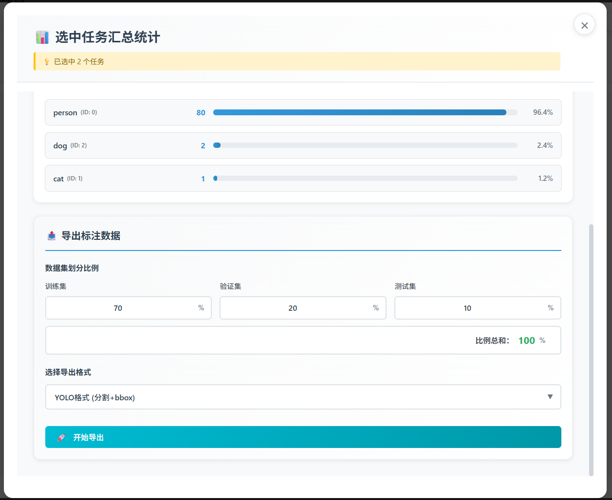
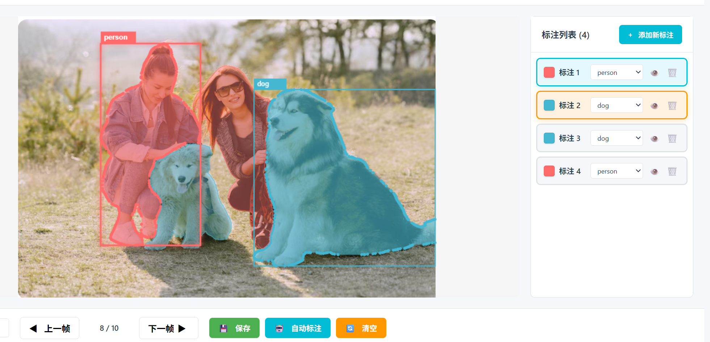
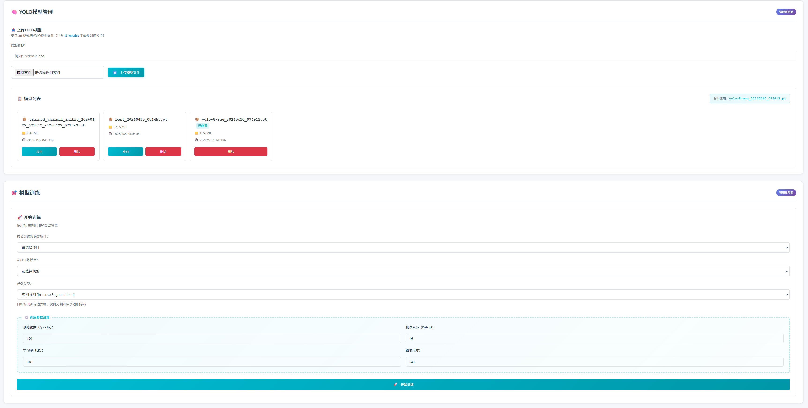

# 使用文档

## 1. 登录

访问 `http://ip:3000`，使用默认管理员账号登录。

- 用户名：`admin`
- 密码：`admin`

> **💡 个人使用提示**
> 
> 如果您是个人使用者，不需要团队协作功能，可以直接使用 `admin` 账号进行所有操作（标注、审核、项目管理等），无需创建其他用户或进行任务分配。跳过"管理面板"和"任务分配"相关步骤即可。

## 2. 管理面板（管理员）

1. 点击头像，进入管理面板
2. 在管理面板中创建用户，并分配权限

## 3. 项目管理（管理员）

1. 初始化标签，创建项目
2. 查看项目的标注进度和统计情况
3. 在项目统计中，**汇总选择特定任务（可多选）导出标注数据**

## 4. 标签管理（管理员）

1. 对已有项目标签进行增删改（谨慎删除）

## 5. 数据集管理（管理员）

1. 选择项目，上传图像压缩包
2. 选择项目，上传视频

## 6. 任务分配（管理员）

1. 分配标注任务给标注员
2. 分配状态已完成的任务给审核员

## 7. 标注操作

1. 对于视频任务需要先抽帧
2. 鼠标点击图像上的目标，基于sam进行辅助标注，左点击为正点，右点击为负点
3. 应用标注模型后，可以实现自动标注，会自动匹配项目标签名，所以请保证项目标签名和模型预测标签名一致

## 8. 审核操作

1. 点击修改，基于sam鼠标点击目标进行标注修改
2. 删除图片即为删除样本

## 9. 模型管理（管理员）

1. 上传yolo模型

2. **在模型列表中应用模型，表示该模型被用到自动标注**

3. 模型训练，训练后的模型可以保存到模型列表中，用于自动标注

